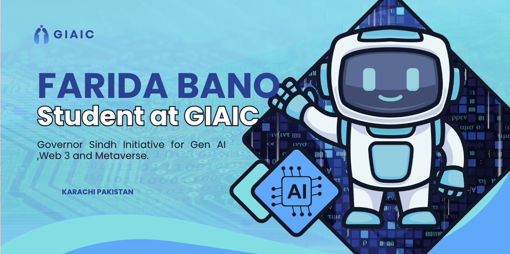
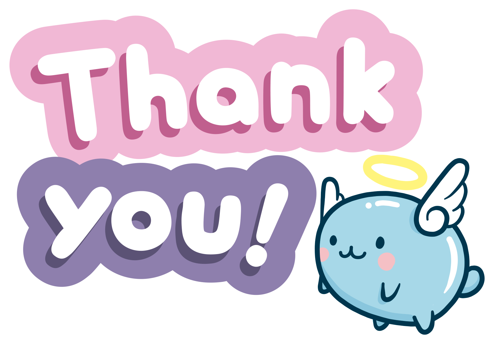

# 🌟 Welcome to My GitHub Profile! 🌟  

### 👋 Hi, I’m **Farida Bano**!  

I am a passionate web developer and aspiring UI/UX designer.  
Currently, I am learning cutting-edge technologies as part of the **Governor Initiative for Gen AI, Web 3.0, and Metaverse**.

**📍 Location:** Karachi, Pakistan  
---
## 🧰 Skills I'm Learning  

| 💻 Technologies           | 🎨 Design Tools                   | 🌐 Other Skills                  |
|---------------------------|----------------------------------|---------------------------------|
| HTML, CSS, JavaScript     | Figma, Canva                    | UI/UX Design                    |
| TypeScript, Next.js       | Shadcn (React Components)       | Art & Craft (Crochet, Knitting) |
| Tailwind CSS              |                                  |                                 |
---

## 📋 What I Do  

- 🌱 **I’m currently learning**: HTML, CSS, TypeScript, Next.js, Tailwind CSS, Shadcn  
- 💞️ **Looking to collaborate**: UI/UX design projects  
- 🎨 **Fun Fact**: I enjoy art & craft, including crochet work & knitting  

---

## 🔗 Connect with Me

  

---

## 🚀 Project Highlights  

Here’s a glimpse of my recent work:  

### 🖼️ Project Preview  

  
---

### ✨ Features  
- **Feature 1**:I created a project in four parts: In the first part, I implemented a user login and registration system with username, password, a search bar, and social media links. The second part involves a transaction feature where users can enter the amount, card number, transaction type, and submit the transaction. In the third part, I added transaction history functionality, allowing users to view, clear, and download their transaction history, with the ability to filter transactions from the last two weeks. Finally, I included a footer at the bottom of the page for a complete layout..  
- **Feature 2**: Add another brief description here.  

---

### 📂 Project Links  
- **Live Preview**: [View Live Project](https://example.com)  
- **Source Code**: [GitHub Repository](https://github.com/username/repository)  

---

## 🎓 About My Education  

I am currently studying as part of the **Governor Initiative for Gen AI, Web 3.0, and Metaverse** in Karachi, Pakistan.  
I am enthusiastic about combining my coding and design skills to create beautiful, functional projects.  

---

## ❤️ Thank You for Visiting!  

If you like my work, feel free to ⭐ my repositories and connect with me. 😊  

